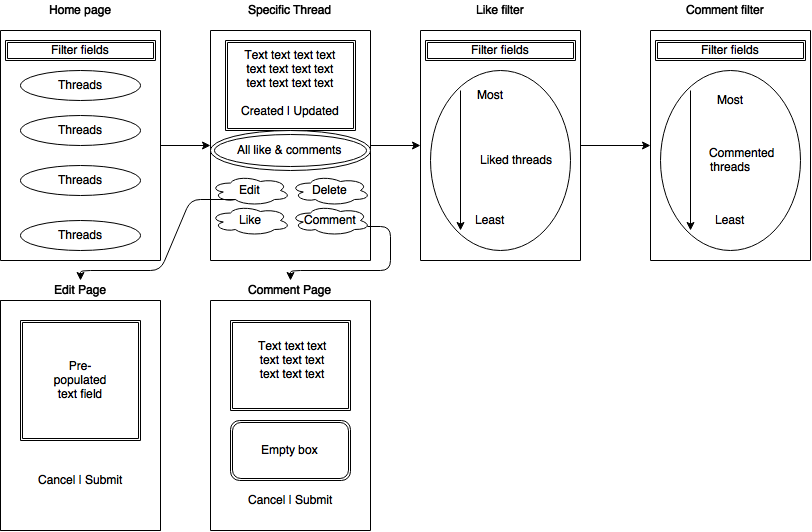
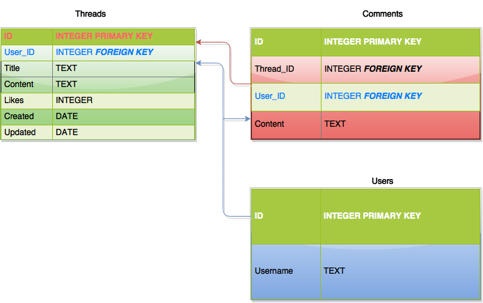

# Krazian_2nd_project.github.io
##Forum Project
###**User Story**
1. User should be able to perform basic CRUD (post new thread, read previous threads, and edit and delete his/her own thread)
2. Posts should have a vote up/like functionality 
3. User can filter posts by number of likes or comments
4. Include responsiveness across different platforms

###**Wireframe**

###**Pseudo-Code**
1. User goes to main pages, server renders page with all stored messages.
2. If user uses filter, user chooses either "likes" or "comments" and hits confirm/submit. Server will render either page with descending number of likes or comments.
3. If user clicks on thread topic from main page, server renders the full message with meta data and options to like, comment, edit, or delete.
4. If user decides to edit, server renders page with text field already populated with the original post.
 * User can cancel edit and be redirected to main page.
 * User can make changes then confirm. Server will update with new entry and redirect user to main page.
5. If user clicks comment, server renders new page with empty text box, cancel and submit button.
6. If user clicks like, render same page with updated 'like' count.
7. If user deletes, the post is removed from database, and user is redirected to main page.

###**Routes**
1. "/home" - main page
2. "/home/likes" - filtered by # of likes
3. "/home/comment/" - filtered by # of comments
4. "/home/:id" - specific thread
5. "/home/:id/edit" - edit page
6. "/home/:id/new" - add new comment

###**ERD**
